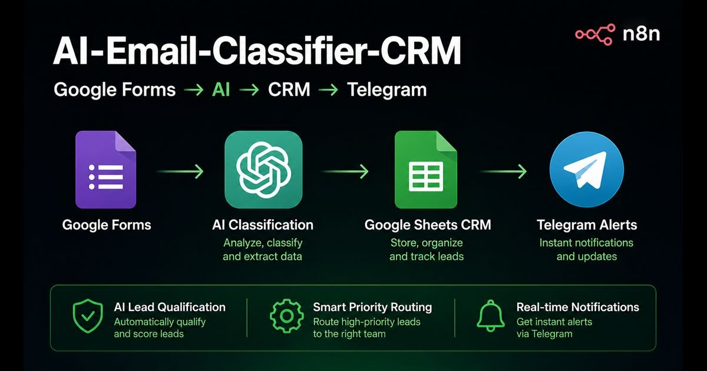
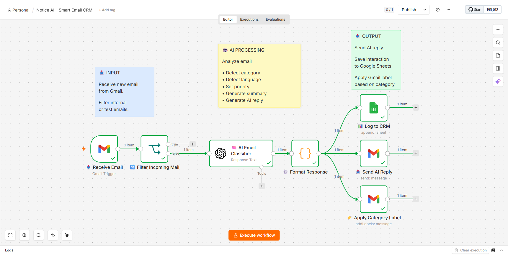
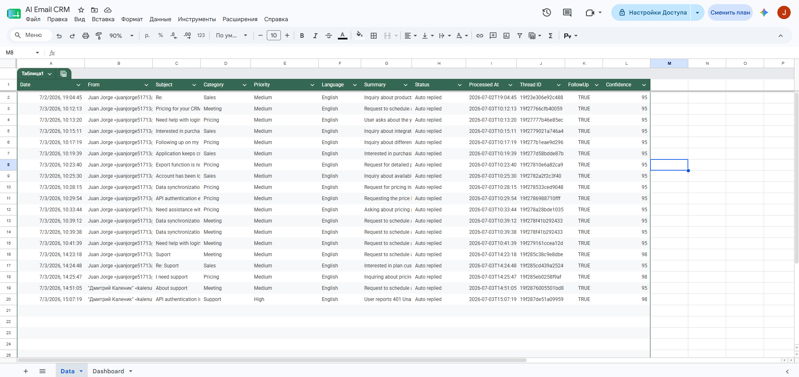
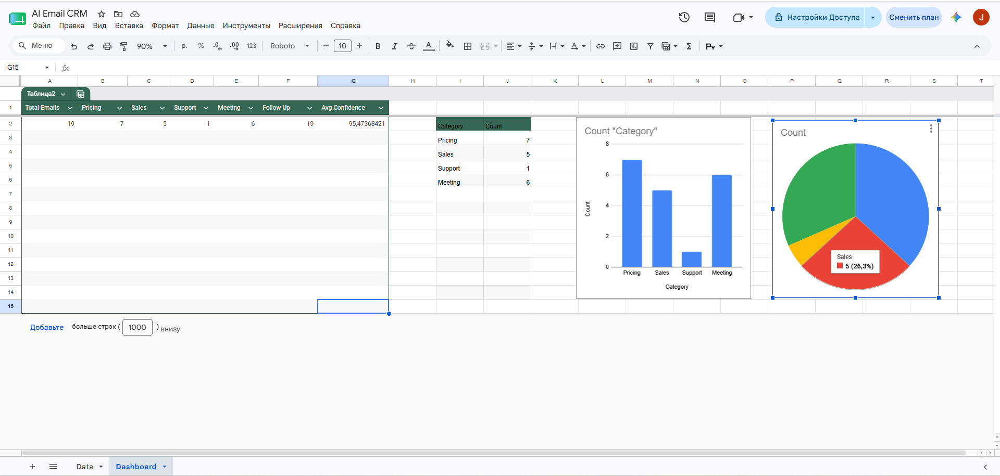
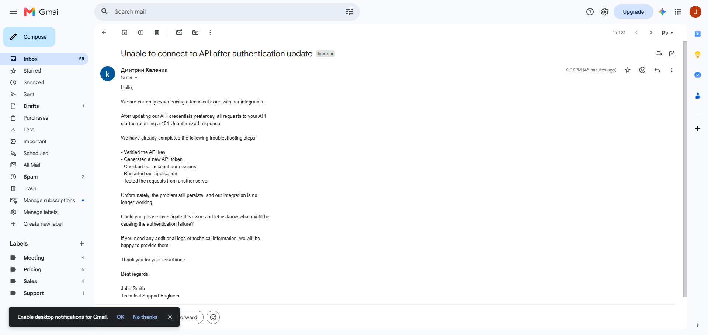
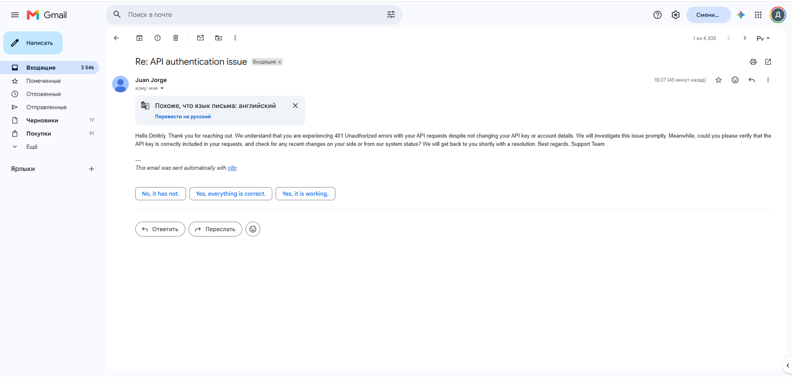

<div align="center">

# 🚀 AI Email Classifier CRM

### AI-Powered Email Classification & Smart CRM Automation with n8n



<br>


</div>

---

# 📌 About

**AI Email Classifier CRM** is a complete AI-powered email automation system built with **n8n**.

The workflow automatically receives incoming emails from **Gmail**, analyzes them using **OpenAI**, classifies each message by category, detects the language, generates an AI summary and reply, stores every interaction inside **Google Sheets CRM**, and automatically applies the appropriate Gmail label.

This project demonstrates how AI can automate an entire email processing pipeline with almost zero manual work.

---

# ✨ Features

- 📥 Automatic Gmail email processing
- 🤖 AI-powered email classification
- 🌍 Automatic language detection
- 📝 AI-generated email summaries
- ✉️ AI-generated email replies
- 🏷 Automatic Gmail label assignment
- 📊 Google Sheets CRM logging
- 📈 Dashboard with email analytics
- ⚡ Fully automated workflow
- 🔧 Easy to customize and extend

---

# 🛠 Tech Stack

| Technology | Purpose |
|------------|---------|
| n8n | Workflow Automation |
| OpenAI API | Email Analysis & AI Reply |
| Gmail API | Email Processing |
| Google Sheets | CRM Storage & Dashboard |

---

# 📊 Workflow

```text
Gmail
   │
   ▼
Receive Email
   │
   ▼
Filter Internal Emails
   │
   ▼
OpenAI Analysis
(Category / Language /
Summary / Reply)
   │
   ▼
Format Response
   │
   ├──────────────► Google Sheets CRM
   │
   ├──────────────► Gmail AI Reply
   │
   └──────────────► Apply Gmail Label
```

---

# 📸 Screenshots

## 🤖 Main AI Email Workflow



Receives emails, analyzes them with AI, generates replies, stores interactions in CRM and applies Gmail labels automatically.

---

## 📊 Google Sheets CRM



Central CRM where every processed email is stored with category, summary, language, confidence score and AI response status.

---

## 📈 CRM Dashboard



Dashboard displaying email statistics, category distribution and AI processing metrics.

---

## 📥 Incoming Support Email



Example of an incoming technical support request received in Gmail.

---

## 🤖 AI Generated Reply



Automatic AI-generated response sent directly from Gmail.

---

# 📁 Project Structure

```text
AI-Email-Classifier-CRM/
│
├── Banner.png
├── README.md
│
└── screenshots/
    ├── workflow.png
    ├── googlesheet.png
    ├── dashboard.png
    ├── incoming-email.png
    └── ai-reply.png
```

---

# 🚀 Project Overview

This repository showcases an AI-powered email automation workflow built with **n8n**, **OpenAI**, **Gmail**, and **Google Sheets**.

The project demonstrates:

- 🤖 AI-powered email classification
- 🌍 Automatic language detection
- ✉️ AI-generated email replies
- 🏷 Intelligent Gmail label automation
- 📊 Google Sheets CRM integration
- ⚡ End-to-end business process automation

> **Note**
>
> The workflow file is **not included** in this repository.
> This project is published as a portfolio showcase demonstrating workflow architecture, automation logic, and system design.

---

# 💼 Business Value

- Reduce manual email processing
- AI-powered email classification
- Automatic CRM synchronization
- Instant AI-generated email replies
- Automatic Gmail organization
- Centralized email history
- Analytics dashboard
- Faster customer response time

---

# 🎯 Use Cases

- AI Email Assistant
- Email CRM Automation
- Customer Support Automation
- AI Helpdesk
- Gmail Automation
- Sales Email Processing
- Business Process Automation
- AI Workflows

---

# 📄 License

This repository is published for **portfolio** and **educational** purposes.

The workflow implementation is showcased as a demonstration project and is **not intended for commercial redistribution**.

---

<div align="center">

### ⭐ If you like this project, give it a star!

</div>
